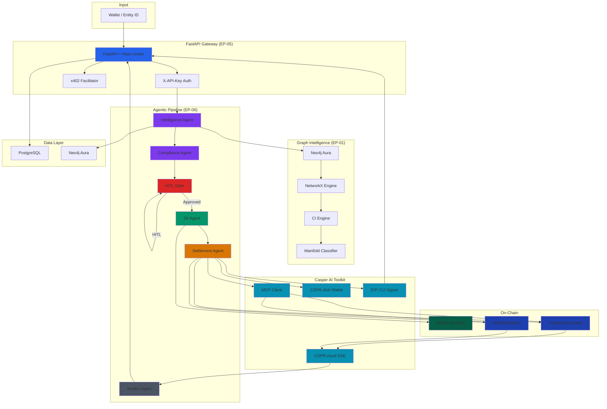
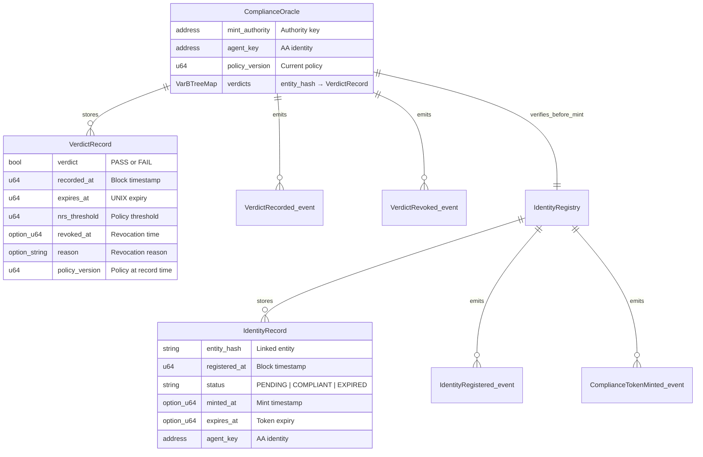

# ZK-KYC Compliance Agent

Privacy-preserving KYC/AML platform combining graph-based risk scoring with zero-knowledge proofs for Stellar and Casper blockchains.

**Target Submissions:** Casper Agentic Buildathon 2026 (Jul 8) · Stellar Hacks: Real-World ZK (Jul 3) · Global AI Hackathon with Qwen Cloud Track 4 (Jul 10)

---

## Project Structure

```
├── zkkyc/                                  # Python backend package
│   ├── config.py                           # Settings, env vars, CI weights
│   ├── cli.py                              # CLI entry point
│   ├── signing.py                          # EIP-712 typed-data signing
│   ├── adapters/                           # Chain-agnostic Passport Adapters (EP-08)
│   │   ├── base.py                         # Abstract PassportAdapterBase
│   │   ├── registry.py                     # AdapterRegistry
│   │   ├── stellar.py                      # Stellar Soroban adapter
│   │   ├── casper.py                       # Casper Odra adapter (+ MCP/AA/EIP-712)
│   │   ├── ethereum.py                     # EVM/Solidity adapter
│   │   ├── polkadot.py                     # Polkadot ink! adapter
│   │   ├── hedera.py                       # Hedera HTS/HSCS adapter
│   │   ├── algorand.py                     # Algorand ASA adapter
│   │   ├── sui.py                          # Sui Move adapter
│   │   ├── aptos.py                        # Aptos Move adapter
│   │   └── icp.py                          # ICP canister adapter
│   ├── agents/                             # LangGraph specialist agents (EP-06)
│   │   ├── graph.py                        # Intelligence Agent (graph + NRS)
│   │   └── settlement.py                   # Settlement Agent (chain dispatch + toolkit)
│   ├── api/                                # FastAPI REST gateway (EP-05)
│   │   ├── main.py                         # All endpoints, auth, rate limiting
│   │   └── schemas.py                      # Pydantic request/response models
│   ├── payments/                           # x402 micropayment rail (EP-05)
│   │   └── x402.py                         # X402PaymentService (+ facilitator)
│   ├── toolkit/                            # Casper AI Toolkit (augmentation)
│   │   ├── x402_facilitator.py             # Official casper-x402 facilitator client
│   │   ├── mcp_server.py                   # Casper MCP Server client
│   │   ├── mcp_mock.py                     # Mock MCP server for local demo
│   │   ├── cspr_click.py                   # Agent-native wallet + deploy signing
│   │   └── events.py                       # CSPR.cloud SSE event streaming
│   ├── graph/                              # Neo4j + NetworkX risk engine (EP-01)
│   │   ├── entity.py                       # Entity/relationship CRUD, PII hashing
│   │   └── nrs.py                          # NRS computation, CI engine, jurisdiction
│   ├── zk/                                 # Noir ZK proof pipeline (EP-02)
│   │   ├── proof.py                        # generate_zk_proof, verify_proof_local
│   │   └── stellar.py                      # Stellar Soroban verification helper
│   └── db/                                 # PostgreSQL persistence (EP-07)
│       ├── __init__.py                     # Database connection pool
│       └── repos.py                        # Repository layer
├── circuits/                               # Noir ZK circuit (EP-02)
│   ├── Nargo.toml
│   ├── Prover.toml
│   └── src/main.nr                         # Three-condition compliance circuit
├── casper/                                 # Casper Odra contracts (EP-04)
│   ├── Cargo.toml
│   ├── llms.txt                            # AI-discoverable contract API
│   ├── compliance_oracle/src/lib.rs        # ComplianceOracle + upgradable policy
│   └── identity_registry/src/lib.rs        # IdentityRegistry + agent_key AA
├── stellar/                                # Stellar Soroban contracts (EP-03)
│   ├── src/lib.rs                          # ComplianceVerifier
│   └── passport/src/lib.rs                 # CompliancePassport
├── ethereum/                               # EVM adapter contracts (EP-08)
│   └── contracts/
│       ├── UltraHonkVerifier.sol
│       ├── UltraVerifier.sol
│       └── ZKPassport.sol
├── polkadot/                               # Polkadot ink! contracts (EP-08)
│   └── contracts/lib.rs
├── hedera/                                 # Hedera contracts (EP-08)
│   └── contracts/
│       ├── HederaZKVerifier.sol
│       ├── UltraVerifier.sol
│       └── ZKPassport.sol
├── algorand/                               # Algorand contracts (EP-08)
│   └── contracts/passport.py
├── sui/                                    # Sui Move contracts (EP-08)
│   └── sources/zk_passport.move
├── aptos/                                  # Aptos Move contracts (EP-08)
│   └── sources/zk_passport.move
├── icp/                                    # ICP canister (EP-08)
│   └── src/lib.rs
├── tests/                                  # Test suite
│   ├── unit/
│   │   └── test_toolkit.py                 # Casper AI Toolkit unit tests
│   ├── integration/
│   │   ├── test_casper_toolkit.py          # Casper toolkit integration tests
│   │   └── test_graph_to_zk.py
│   ├── conformance/
│   │   └── test_adapter_conformance.py     # PassportAdapter conformance suite
│   ├── test_unit.py                        # Core domain unit tests
│   └── test_endpoints.py                   # FastAPI endpoint tests
├── migrations/                             # Database migrations
│   ├── 001_initial_schema.sql
│   └── neo4j/001_v2_schema.cypher
├── scripts/                                # Operational scripts
│   ├── demo_passport.sh                    # Stellar passport demo
│   ├── e2e_casper.sh                       # Casper testnet e2e
│   └── seed_knowledge_graph.py
├── docs/                                   # Documentation
│   ├── data_classification.md
│   ├── privacy_audit.md
│   ├── passport_adapter_spec.md
│   └── grants/
│       ├── pipeline.md
│       ├── evm_grants.md
│       ├── web3_foundation.md
│       ├── hbar_foundation.md
│       ├── algorand.md
│       ├── sui_aptos.md
│       └── icp.md
├── docker-compose.dev.yml                  # Dev environment (Neo4j, Postgres)
├── pyproject.toml
├── pytest.ini
├── deployments.json
├── casper.md                               # Casper AI Toolkit augmentation analysis
├── CONTRACTS.md
├── zk_kyc_platform_spec.md                 # Master product specification
└── README.md
```

---

## Application Logic

### Purpose

ZKCO transforms compliance from an application into **infrastructure**. Instead of every DeFi protocol running its own KYC, ZKCO produces a portable, reusable **Compliance Passport** — a zero-knowledge-proved attestation that a wallet satisfies AML, KYC, Sanctions, Jurisdiction, and FATF policy. The blockchain sees only: "this wallet is compliant." The underlying financial intelligence — graph topology, risk weights, factor scores, entity identity — never leaves the off-chain oracle.

### Pipeline

```
Entity/Wallet Input
        ↓
[1] Graph Intelligence (EP-01)
    Neo4j Aura + NetworkX
    - Entity nodes keyed by SHA-256 hashes (PII never in plaintext)
    - TRANSACTED_WITH relationships
    - PageRank, Betweenness, Louvain communities
    - Node2Vec embeddings → behavioural manifold (k=5)
        ↓
[2] Multi-Factor Risk Engine (EP-01)
    Six factors → Compliance Index (CI)
    L: Liquidity, C: Counterparty, J: Jurisdiction,
    S: Sanctions, A: AML Topology, B: Behavioural
    CI = w1·L + w2·C + w3·J + w4·S + w5·A + w6·B  [configurable]
        ↓
[3] ZK Proof Layer (EP-02)
    Noir UltraHonk three-condition proof:
      - CI < threshold
      - manifold_score >= threshold
      - jurisdiction_flag == 0
    Private: CI, manifold_score, jurisdiction_flag
    Public: ci_threshold, manifold_threshold, policy_id
        ↓
[4] Chain Adapter Layer (EP-08)
    One interface, N chains:
      Stellar → Soroban CompliancePassport
      Casper  → Odra ComplianceOracle + IdentityRegistry
      EVM     → Solidity UltraHonkVerifier + ERC-721 soulbound
      Polkadot → ink! Wasm verifier + passport
      Hedera  → HTS non-transferable token + HSCS verifier
      Algorand → ASA with clawback + PyTeal verifier
      Sui/Aptos → Move frozen objects
      ICP     → Canister-based verifier
        ↓
[5] Agentic Orchestration (EP-06)
    Five-specialist LangGraph pipeline:
      Intelligence Agent → Compliance Agent → ZK Agent
      → Settlement Agent → Auditor Agent
    Qwen2.5-72B-Instruct via DashScope for regulatory reasoning
        ↓
[6] Micropayment Rail (EP-05)
    Casper x402 Protocol: pay-per-request API for AI agents
    402 challenge → CSPR micropayment → proof verification → data response
```

### Epic Summaries

**EP-01 Graph Intelligence & Multi-Factor Financial Risk Engine**
Produces the Compliance Index (CI) from graph-structural computations. Entity nodes are SHA-256 hashed (PII never in Neo4j). NetworkX computes PageRank, Betweenness Centrality, and Louvain communities. Six independent risk factors (L, C, J, S, A, B) are aggregated into a weighted CI. Node2Vec embeddings + k-means (k=5) classify wallets into behavioural risk clusters.

**EP-02 Zero-Knowledge Compliance Oracle Circuit**
Noir circuit proves three conditions simultaneously: `CI < threshold ∧ manifold_score >= threshold ∧ jurisdiction_flag == 0`. UltraHonk proof generated via `nargo prove`, verified via `nargo verify`. Stellar Soroban verifier validates on-chain.

**EP-03 Stellar Compliance Passport & Protocol Gateway**
Non-transferable Compliance Passport minted on Stellar testnet after ZK proof verification. `verify_credential()` callable by any protocol without re-running KYC. Selective disclosure returns boolean pass/fail labels only.

**EP-04 Casper ComplianceOracle & On-Chain Verifiability**
Odra smart contracts: `ComplianceOracle` stores PASS/FAIL verdicts with expiry and revocation. `IdentityRegistry` maps wallets to compliance token status. Augmented with `agent_key` (Account Abstraction) and `policy_version` (upgradable contracts).

**EP-05 API Gateway & Micropayment Rail**
FastAPI gateway with `X-API-Key` authentication, bcrypt-hashed keys, rate limiting (default 60 RPM). x402 micropayment gate: 402 challenge → CSPR deploy proof → verification → data response. Official Casper x402 Facilitator integration with legacy CSPR.cloud fallback.

**EP-06 Specialist Agentic Compliance Orchestration**
LangGraph pipeline: Intelligence Agent (graph + NRS) → Compliance Agent (Qwen2.5 + deterministic rule engine) → ZK Agent (Noir proof) → Settlement Agent (chain dispatch via MCP + CSPR.click) → Auditor Agent (audit report + selective disclosure). Every tool call logged to `agent_tool_calls`.

**EP-07 Data Governance & Security Lifecycle**
PII minimisation: raw entity IDs never stored; SHA-256 hashes everywhere. Security events: `AUTH_FAILURE`, `PROOF_GENERATED`, `ON_CHAIN_DISPATCH`, `HITL_ESCALATION`. Audit trail: full lineage from graph data → proof → on-chain dispatch. RESTRICTED fields use AES-256-GCM.

**EP-08 Chain-Agnostic Passport Adapter & Grant Pipeline**
Abstract `PassportAdapterBase` with 5 operations. 8 chain adapters implemented. Conformance test suite: 8 parameterised tests. Grant documentation for each ecosystem.

**EP-09 Qwen Cloud Autopilot Agent (Track 4)**
Qwen2.5-72B-Instruct via DashScope. Human-in-the-Loop Gate for borderline cases. Alibaba Cloud ECS deployment. 3-minute demo video. Devpost submission.

**Casper AI Toolkit Augmentations**
Eight components integrated beyond the original spec: official x402 Facilitator, Casper MCP Server client, CSPR.cloud SSE streaming, CSPR.click agent wallet, Odra `llms.txt`, Account Abstraction (`agent_key`), Upgradable Contracts (`upgrade_policy`), and casper-eip-712 typed-data signing.

---

## API Reference

### Health & Graph

| Method | Endpoint | Auth | Description |
|--------|----------|------|-------------|
| GET | `/health` | None | Liveness probe |
| GET | `/api/v1/graph/health` | API Key | Neo4j status, node/relationship counts |

### Entity & Relationships

| Method | Endpoint | Auth | Description |
|--------|----------|------|-------------|
| POST | `/api/v1/entity` | API Key | Create/upsert entity (201/200) |
| POST | `/api/v1/relationship` | API Key | Create single relationship |
| POST | `/api/v1/relationships/batch` | API Key | Bulk ingest up to 1,000 relationships |
| GET | `/api/v1/entity/{id}/relationships` | API Key | Retrieve entity relationships |

### Risk Intelligence

| Method | Endpoint | Auth | Description |
|--------|----------|------|-------------|
| GET | `/api/v1/entity/{id}/nrs` | API Key + x402 | Compliance Index (payment-gated) |
| GET | `/api/v1/entity/{id}/factors` | API Key | Six-factor breakdown (L, C, J, S, A, B) |
| GET | `/api/v1/entity/{id}/manifold` | API Key | Behavioural cluster + manifold score |
| GET | `/api/v1/entity/{id}/anomalies` | API Key | Structural anomaly flags |

### ZK Proof & Credentials

| Method | Endpoint | Auth | Description |
|--------|----------|------|-------------|
| POST | `/api/v1/prove/{id}` | API Key | Generate Noir three-condition ZK proof |
| GET | `/api/v1/entity/{id}/credential` | API Key | Latest compliance credential (24h expiry) |
| POST | `/api/v1/entity/{id}/mint-passport` | API Key | Mint Compliance Passport on target chain |

### Casper-Specific

| Method | Endpoint | Auth | Description |
|--------|----------|------|-------------|
| GET | `/api/v1/casper/verdict/{hash}` | API Key | Casper ComplianceOracle proxy (60s cache) |

### Admin & Audit

| Method | Endpoint | Auth | Description |
|--------|----------|------|-------------|
| POST | `/api/v1/keys` | Admin | Generate new API key |
| POST | `/api/v1/keys/{key_id}/limit` | Admin | Update rate limit (max 600 RPM) |
| GET | `/api/v1/payments/summary` | Admin | CSPR payment summary (30 days) |
| GET | `/api/v1/incidents` | API Key | Paginated compliance incidents |
| POST | `/api/v1/admin/jurisdiction/refresh` | Admin | Refresh FATF jurisdiction table |
| GET | `/api/v1/admin/jurisdiction` | Admin | List jurisdiction risk scores |
| GET | `/api/v1/audit/{entity_hash}` | Admin | Full audit trail |
| GET | `/api/v1/security/events` | Admin | Security event log |
| POST | `/api/v1/entity/{hash}/disclose` | Disclosure Key | Selective disclosure (boolean labels) |

### Casper AI Toolkit

| Method | Endpoint | Auth | Description |
|--------|----------|------|-------------|
| GET | `/api/v1/toolkit/agent-wallet` | Admin | Agent wallet public key + balance |
| GET | `/api/v1/toolkit/x402/health` | Admin | x402 facilitator status |
| GET | `/api/v1/toolkit/mcp/health` | Admin | MCP server status |
| GET | `/api/v1/events/stream` | API Key | SSE stream for Casper events |

### Agent Pipeline

| Method | Endpoint | Auth | Description |
|--------|----------|------|-------------|
| GET | `/api/v1/runs` | API Key | List LangGraph execution traces |
| POST | `/api/v1/runs` | API Key | Trigger new agent pipeline run |
| GET | `/api/v1/runs/{run_id}` | API Key | Retrieve execution trace |

---

## Architecture Diagrams

### System Architecture



### Data Flow: Entity → Compliance Passport

```mermaid
flowchart LR
    A[Raw Entity ID] --> B[SHA-256 Hash]
    B --> C[Neo4j Entity Node]
    C --> D[Export Subgraph]
    D --> E[NetworkX DiGraph]
    E --> F[PageRank + Betweenness + Louvain]
    E --> G[Node2Vec Embeddings]
    G --> H[k-means k=5]
    F --> I[Six-Factor CI]
    H --> I
    I --> J[Compliance Index]
    J --> K[Noir Circuit]
    K --> L[UltraHonk Proof]
    L --> M{Settlement Agent}
    M -->|stellar| N[Soroban Verifier + Passport]
    M -->|casper| O[ComplianceOracle]
    O --> P[IdentityRegistry]
    N --> Q[Portable Compliance Passport]
    P --> Q
    Q --> R[Downstream Protocols]
```



### Casper On-Chain Data Model



### PostgreSQL Data Model

```mermaid
erDiagram
    api_keys ||--o{ payment_receipts : "owns"
    api_keys ||--o{ security_events : "generates"
    entities ||--o{ compliance_index_computations : "has"
    entities ||--o{ risk_factors : "has"
    entities ||--o{ compliance_incidents : "triggers"
    entities ||--o{ verifications : "has"
    entities ||--o{ disclosure_audit : "requests"
    entities ||--o{ agent_executions : "runs"
    entities ||--o{ agent_tool_calls : "invokes"

    api_keys {
        uuid id PK
        string key_hash "bcrypt"
        string name
        int rate_limit_rpm
        bool is_active
        timestamp created_at
    }

    compliance_index_computations {
        uuid id PK
        string entity_hash
        float compliance_index
        float manifold_score
        int jurisdiction_flag
        json weights_used
        json factor_breakdown
        string triggered_by
        timestamp computed_at
    }

    risk_factors {
        uuid id PK
        string entity_hash
        float L C J S A B
        bool b_is_stub
        timestamp computed_at
    }

    verifications {
        uuid id PK
        string entity_hash
        text stellar_tx_hash
        text proof_hex
        float threshold_public
        string status
        timestamp verified_at
    }

    payment_receipts {
        uuid id PK
        string deploy_hash
        string entity_hash
        float amount_cspr
        string api_key_id
        timestamp paid_at
    }

    agent_executions {
        uuid run_id PK
        string entity_id
        string chain_target
        string compliance_decision
        json state_json
        json step_log
        string status
        timestamp created_at
    }

    agent_tool_calls {
        uuid id PK
        string run_id
        string agent_name
        string tool_name
        string action
        json input_summary_json
        json output_summary_json
        int duration_ms
        timestamp occurred_at
    }

    security_events {
        uuid id PK
        string event_type
        string severity
        string entity_hash
        string source_ip
        json metadata_json
        timestamp occurred_at
    }
```

---

## Data Model

### Core Entities

| Entity | Storage | Key | PII Handling |
|--------|---------|-----|--------------|
| Entity | Neo4j + Postgres | `entity_hash = SHA256(raw_id + salt)` | Raw ID never in Neo4j; mapping in encrypted Postgres |
| Relationship | Neo4j | Composite `(source_hash, target_hash, tx_hash)` | Only hashed IDs |
| Compliance Index | Postgres | `entity_hash` | CI value never returned externally |
| Risk Factors | Postgres | `entity_hash` | Individual factors never returned externally |
| Verification | Postgres | `entity_hash` | Stores `proof_hex`, `stellar_tx_hash` |
| Payment Receipt | Postgres | `deploy_hash` | Links to `entity_hash` for audit |
| Incident | Postgres | `entity_hash` | CI threshold breach record |
| Disclosure Audit | Postgres | `entity_hash` | Boolean labels only, never raw scores |
| Agent Execution | Postgres | `run_id` | Full LangGraph state JSON |
| Agent Tool Call | Postgres | `run_id` | Structured JSON per MCP/casper call |
| Security Event | Postgres | `event_type + occurred_at` | Immutable append-only |
| Casper Verdict | Postgres | `entity_hash` | 60s cached proxy for on-chain query |

### Casper On-Chain State

| Contract | State | Description |
|----------|-------|-------------|
| ComplianceOracle | `verdicts: VarBTreeMap<String, VerdictRecord>` | On-chain PASS/FAIL records |
| ComplianceOracle | `mint_authority: Var<Address>` | Authorised deployer |
| ComplianceOracle | `policy_version: Var<u64>` | Current compliance policy version |
| ComplianceOracle | `agent_key: Var<Address>` | Settlement Agent AA identity |
| IdentityRegistry | `identities: VarBTreeMap<Address, IdentityRecord>` | Wallet → compliance status |
| IdentityRegistry | `compliance_oracle: Var<Address>` | Linked oracle contract |
| IdentityRegistry | `agent_key: Var<Address>` | Settlement Agent AA identity |

---

## Chain Credentials

| Chain | Tooling / SDK | Required Credentials | Testnet Faucet |
|-------|--------------|---------------------|----------------|
| **Stellar** | Soroban CLI, Rust 1.75+ | `STELLAR_SECRET_KEY`, Soroban RPC URL | [Stellar Friendbot](https://laboratory.stellar.org/#account-create?network=test) |
| **Casper** | Odra, Rust 1.75+ | `CASPER_SURI`, `CASPER_SECRET_KEY_PATH` | [Casper Faucet](https://testnet.casper.network/) |
| **EVM** | Foundry, Hardhat | `PRIVATE_KEY`, `SEPOLIA_RPC_URL`, `ETHERSCAN_API_KEY` | [Alchemy Faucet](https://sepoliafaucet.com/) |
| **Polkadot** | cargo-contract 3.0+, substrateinterface | `SURI`, `ROCOCO_RPC_URL` | [Polkadot Faucet](https://faucet.polkadot.io/) |
| **Hedera** | Hardhat, Hedera SDK | `HEDERA_ACCOUNT_ID`, `HEDERA_PRIVATE_KEY` | [Hedera Portal](https://portal.hedera.com/) |
| **Algorand** | PyTeal, algosdk | `DEPLOYER_MNEMONIC`, `ALGOD_ADDRESS` | [Algorand Faucet](https://testnet.algorand.foundation/) |
| **Sui** | Sui CLI 1.0+, Move | `SUI_PRIVATE_KEY`, `SUI_NETWORK` | [Sui Faucet](https://faucet.sui.io/) |
| **Aptos** | Aptos CLI 1.0+, Move | `APTOS_PRIVATE_KEY`, `APTOS_NETWORK` | [Aptos Faucet](https://faucet.aptoslabs.com/) |
| **ICP** | DFX 0.14+, Rust 1.75+ | `DFX_NETWORK`, DFX identity | N/A (local replica) |

---

## Testing

```bash
# Unit tests
pytest tests/unit/ -v

# Integration tests (requires Neo4j running)
pytest tests/integration/ -v

# Conformance tests
pytest tests/conformance/ -v
```

---

## Deployments

- Stellar testnet: See `deployments.json`
- Casper testnet: See `deployments.json`
