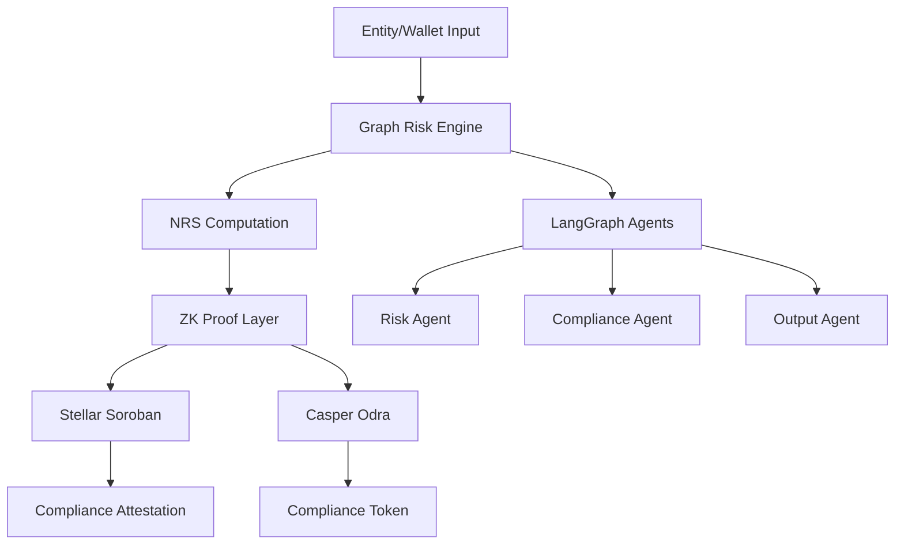
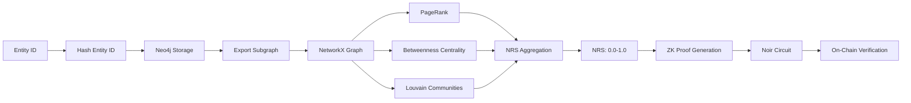
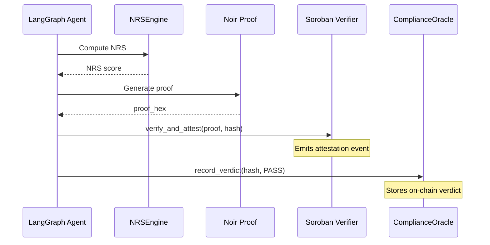
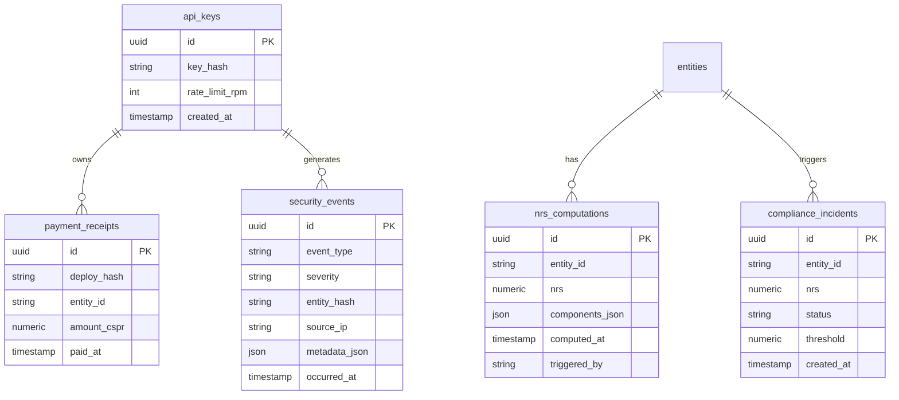

# ZK-KYC Compliance Agent

Privacy-preserving KYC/AML platform combining graph-based risk scoring with zero-knowledge proofs for Stellar and Casper blockchains.

## Project Structure

```
zkkyc/                    # Python package
├── __init__.py
├── config.py            # Settings and environment configuration
├── cli.py               # CLI entry point
├── graph/
│   ├── __init__.py
│   ├── entity.py        # Neo4j entity/relationship service
│   └── nrs.py           # NetworkX risk scoring engine
├── agents/
│   ├── __init__.py
│   └── graph.py         # LangGraph compliance pipeline
├── api/
│   ├── __init__.py
│   └── main.py          # FastAPI REST gateway
├── payments/
│   ├── __init__.py
│   └── x402.py          # Casper micropayment verification
└── zk/
    ├── __init__.py
    └── proof.py           # Noir proof generation pipeline

circuits/                 # Noir ZK circuit
└── src/
    └── main.nr          # Multi-condition compliance policy circuit (CI < threshold ∧ manifold ≥ threshold ∧ jurisdiction permitted)

casper/                   # Casper Odra contracts (Rust)
├── Cargo.toml
├── compliance_oracle/
│   └── src/
│       └── lib.rs       # ComplianceOracle contract
└── identity_registry/
    └── src/
        └── lib.rs       # IdentityRegistry contract

stellar/                  # Stellar Soroban contracts (Rust)
├── Cargo.toml
├── passport/
│   └── src/
│       └── lib.rs       # CompliancePassport contract
└── src/
    └── lib.rs           # ComplianceVerifier contract

tests/
├── unit/
│   └── __init__.py
├── integration/
│   ├── __init__.py
│   └── test_graph_to_zk.py
└── e2e/
    └── __init__.py

scripts/
├── demo_passport.sh       # Stellar Compliance Passport end-to-end demo
├── e2e_casper.sh          # Casper testnet deployment
└── e2e_stellar.sh         # Stellar testnet deployment

migrations/
└── 001_initial_schema.sql

docs/
├── data_classification.md
└── privacy_audit.md
```

## Documentation Index

| File | Description |
|------|-------------|
| [Platform Specification](zk_kyc_platform_spec.md) | Product requirements, epics, features, and acceptance criteria |
| [Data Classification Manifest](docs/data_classification.md) | Data asset classification and encryption controls |
| [Privacy Audit Report Template](docs/privacy_audit.md) | PII handling, compliance controls, and audit checklist |

## Quick Start (Development)

```bash
# Start development environment
docker-compose -f docker-compose.dev.yml up -d

# Install dependencies
pip install -e ".[dev]"

# Run API server
uvicorn zkkyc.api.main:create_app --reload
```

## Architectural Diagrams

### System Architecture



### Data Flow



### Smart Contract Interaction



### Database Schema



## Endpoints

| Method | Endpoint | Description |
|--------|----------|-------------|
| POST | `/api/v1/entity` | Create/upsert entity node |
| POST | `/api/v1/relationship` | Add transaction relationship |
| GET | `/api/v1/entity/{id}/nrs` | Get computed Compliance Index (CI) |
| POST | `/api/v1/prove/{id}` | Generate ZK compliance proof |
| GET | `/health` | Health check endpoint |

## CLI Usage

```bash
# Run full agentic workflow
python -m zkkyc.run --entity-id <id> --chain stellar

# Or directly
python -m zkkyc.cli --entity-id test_entity --chain casper
```

## Deployments

- Stellar testnet: See `deployments.json`
- Casper testnet: See `deployments.json`

## Testing

```bash
# Unit tests
pytest tests/unit/ -v

# Integration tests (requires Neo4j running)
pytest tests/integration/ -v
```

## Technology Stack

| Component | Technology |
|-----------|------------|
| Graph Database | Neo4j Aura Free |
| Graph Algorithms | NetworkX |
| ZK Circuit | Noir (v0.30+) |
| Soroban Verifier | rs-soroban-ultrahonk |
| Casper Contracts | Odra Framework |
| Agent Orchestration | LangGraph |
| LLM Reasoning | Groq API (Llama 3.3 70B) |
| API Layer | FastAPI + Uvicorn |
| Relational Storage | PostgreSQL |

## Chain Credentials & Prerequisites

| Chain | Tooling / SDK | Required Credentials | Testnet Faucet |
|-------|--------------|---------------------|----------------|
| **Stellar** | Soroban CLI, Rust 1.75+ | `STELLAR_SECRET_KEY`, Soroban RPC URL | [Stellar Friendbot](https://laboratory.stellar.org/#account-create?network=test) |
| **Casper** | Odra, Rust 1.75+ | `CASPER_SURI` (e.g. `//Alice`) | [Casper Faucet](https://testnet.casper.network/) |
| **EVM** | Foundry, Hardhat | `PRIVATE_KEY`, `SEPOLIA_RPC_URL` / `MAINNET_RPC_URL`, `ETHERSCAN_API_KEY` | [Alchemy Faucet](https://sepoliafaucet.com/) |
| **Polkadot** | cargo-contract 3.0+, substrateinterface | `SURI`, `ROCOCO_RPC_URL` | [Polkadot Faucet](https://faucet.polkadot.io/) |
| **Hedera** | Hardhat, Hedera SDK | `HEDERA_ACCOUNT_ID`, `HEDERA_PRIVATE_KEY`, `HEDERA_NETWORK` | [Hedera Portal](https://portal.hedera.com/) |
| **Algorand** | PyTeal, algosdk | `DEPLOYER_MNEMONIC`, `ALGOD_ADDRESS`, `ALGOD_TOKEN` | [Algorand Faucet](https://testnet.algorand.foundation/) |
| **Sui** | Sui CLI 1.0+, Move compiler | `SUI_PRIVATE_KEY`, `SUI_NETWORK` | [Sui Faucet](https://faucet.sui.io/) |
| **Aptos** | Aptos CLI 1.0+, Move compiler | `APTOS_PRIVATE_KEY`, `APTOS_ACCOUNT`, `APTOS_NETWORK` | [Aptos Faucet](https://faucet.aptoslabs.com/) |
| **ICP** | DFX 0.14+, Rust 1.75+ | `DFX_NETWORK`, DFX identity | N/A (local replica) |

### Stellar (Soroban)

**Env vars** (`.env` or environment):

```bash
STELLAR_SECRET_KEY=SDX...
STELLAR_RPC_URL=https://soroban-testnet.stellar.org
PASSPORT_CONTRACT_ID=
VERIFIER_CONTRACT_ID=
```

**Dependencies:**

- Rust 1.75+ (via `rustup`)
- Soroban CLI (`cargo install soroban-cli`)

**Notes:** Testnet accounts funded via Friendbot. Contract IDs must be recorded post-deployment.

---

### Casper (Odra)

**Env vars:**

```bash
CASPER_SURI=//Alice
CASPER_RPC_URL=https://node-rpc-dev.casper.network:7777/rpc
CASPER_CHAIN_NAME=casper-test
```

**Dependencies:**

- Rust 1.75+
- Odra Framework

**Notes:** Testnet CSPR can be requested from the Casper faucet. `SURI` is the key derivation path for the deployer account.

---

### EVM (Ethereum, Base, Arbitrum, Optimism, Polygon)

**Env vars** (`.env`):

```bash
PRIVATE_KEY=0x...
SEPOLIA_RPC_URL=https://rpc.sepolia.org
MAINNET_RPC_URL=https://eth-mainnet.g.alchemy.com/v2/...
BASE_RPC_URL=https://base-mainnet.g.alchemy.com/v2/...
ARBITRUM_RPC_URL=https://arb1.arbitrum.io/rpc
OPTIMISM_RPC_URL=https://mainnet.optimism.io
POLYGON_RPC_URL=https://polygon-rpc.com
ETHERSCAN_API_KEY=...
BASESCAN_API_KEY=...
VERIFIER_ADDRESS=
PASSPORT_ADDRESS=
```

**Dependencies:**

- Foundry (`foundryup`)
- OpenZeppelin Contracts (`forge install OpenZeppelin/openzeppelin-contracts --no-commit`)

**Notes:** For Base/Arbitrum/Optimism/Polygon, replace `ETHERSCAN_API_KEY` with the appropriate block explorer API key (`BASESCAN_API_KEY`, `ARBISCAN_API_KEY`, etc.).

---

### Polkadot (Parachains)

**Env vars** (`.env`):

```bash
SURI=//Alice
ROCOCO_RPC_URL=wss://rococo-rpc.polkadot.io
PASEO_RPC_URL=wss://paseo-rpc.polkadot.io
VERIFIER_CONTRACT_ADDRESS=
PASSPORT_CONTRACT_ADDRESS=
```

**Dependencies:**

- Rust 1.75+
- cargo-contract 3.0+ (`cargo install cargo-contract --force`)
- Substrate node (rococo-dev, paseo, or custom parachain)

**Notes:** `SURI` must correspond to an account with sufficient balance on the target parachain. Polkadot Assets Hub or a custom parachain pallet is required for NFT operations.

---

### Hedera (HSCS + HTS)

**Env vars** (`.env`):

```bash
HEDERA_NETWORK=testnet
HEDERA_ACCOUNT_ID=0.0.123456
HEDERA_PRIVATE_KEY=302e020100300506032b657004220420...
VERIFIER_CONTRACT_ID=
PASSPORT_CONTRACT_ID=
```

**Dependencies:**

- Hardhat (`npm install`)
- Hedera SDK (`@hashgraph/sdk`)
- OpenZeppelin Contracts

**Notes:** Account credentials must be obtained from the [Hedera Portal](https://portal.hedera.com/). Testnet HBAR is available from the faucet. Contract IDs are in the format `0.0.xxxxx`.

---

### Algorand (AVM)

**Env vars** (`.env`):

```bash
ALGOD_ADDRESS=https://testnet-api.algonode.cloud
ALGOD_TOKEN=
DEPLOYER_MNEMONIC=...
APP_ID=
```

**Dependencies:**

- Python 3.9+
- PyTeal (`pip install pyteal`)
- Algorand SDK (`pip install algosdk`)

**Notes:** Deployer mnemonic must be funded with testnet ALGO via the [Algorand Faucet](https://testnet.algorand.foundation/). `APP_ID` is the numeric application ID returned after deployment.

---

### Sui (Move VM)

**Env vars** (`.env`):

```bash
SUI_NETWORK=testnet
SUI_PRIVATE_KEY=suiprivkey1...
PACKAGE_ID=0x...
```

**Dependencies:**

- Sui CLI 1.0+
- Move compiler

**Notes:** Private key must be in Sui's ed25519 format. Testnet SUI can be requested from the [Sui Faucet](https://faucet.sui.io/). `PACKAGE_ID` is the published package object ID.

---

### Aptos (Move VM — Token V2)

**Env vars** (`.env`):

```bash
APTOS_NETWORK=testnet
APTOS_PRIVATE_KEY=0x...
APTOS_ACCOUNT=0x...
CONTRACT_ADDRESS=0x...
```

**Dependencies:**

- Aptos CLI 1.0+
- Move compiler

**Notes:** Private key and account address must match. Testnet APT can be requested from the [Aptos Faucet](https://faucet.aptoslabs.com/). `CONTRACT_ADDRESS` is the deployer account address that owns the published module.

---

### ICP (Internet Computer)

**Env vars** (`.env` or `dfx.json`):

```bash
DFX_NETWORK=local
CANISTER_ID=rrkah-fqaaa-aaaaa-aaaaq-cai
```

**Dependencies:**

- DFX 0.14+
- Rust 1.75+
- Cargo

**Notes:** Local development uses `dfx start --background`. Mainnet requires cycles for canister creation. Internet Identity integration requires the II canister to be deployed separately.

---

## Deployments

- Stellar testnet: See `deployments.json`
- Casper testnet: See `deployments.json`