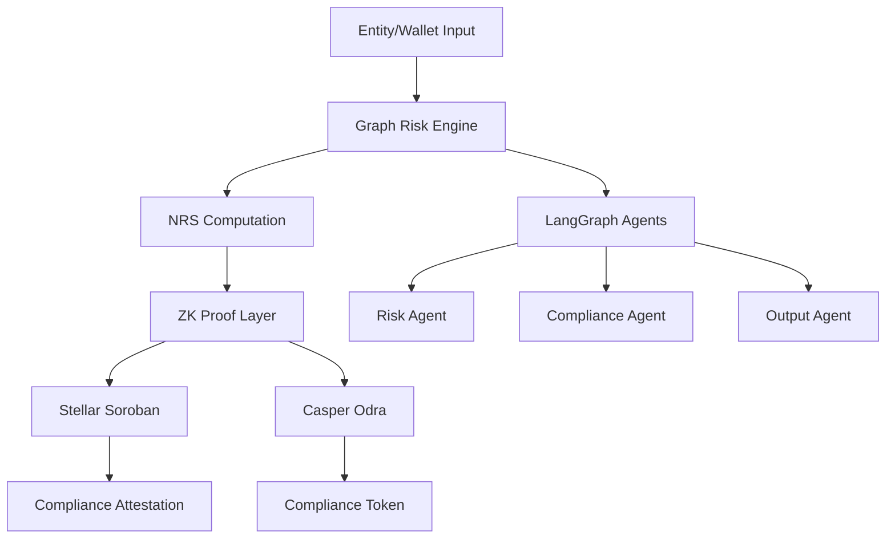
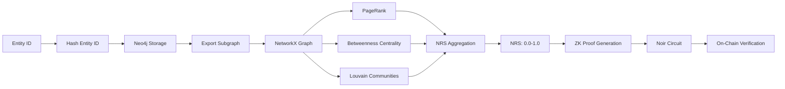
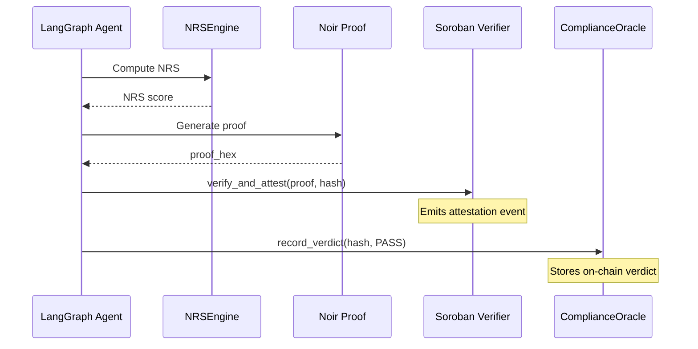
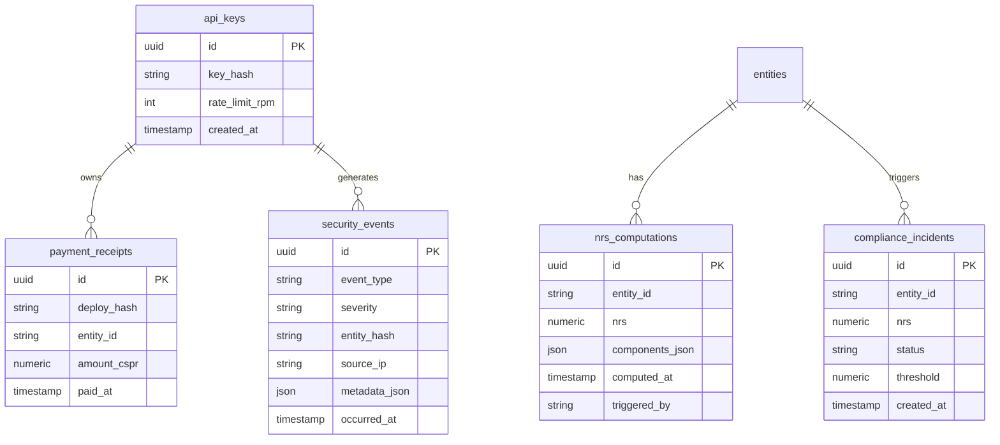

# ZK-KYC Compliance Agent

Privacy-preserving KYC/AML platform combining graph-based risk scoring with zero-knowledge proofs for Stellar and Casper blockchains.

## Project Structure

```
zkkyc/                    # Python package
├── __init__.py
├── config.py            # Settings and environment configuration
├── cli.py               # CLI entry point
├── graph/
│   ├── __init__.py
│   ├── entity.py        # Neo4j entity/relationship service
│   └── nrs.py           # NetworkX risk scoring engine
├── agents/
│   ├── __init__.py
│   └── graph.py         # LangGraph compliance pipeline
├── api/
│   ├── __init__.py
│   └── main.py          # FastAPI REST gateway
├── payments/
│   ├── __init__.py
│   └── x402.py          # Casper micropayment verification
└── zk/
    ├── __init__.py
    └── proof.py           # Noir proof generation pipeline

circuits/                 # Noir ZK circuit
└── src/
    └── main.nr          # Multi-condition compliance policy circuit (CI < threshold ∧ manifold ≥ threshold ∧ jurisdiction permitted)

casper/                   # Casper Odra contracts (Rust)
├── Cargo.toml
├── compliance_oracle/
│   └── src/
│       └── lib.rs       # ComplianceOracle contract
└── identity_registry/
    └── src/
        └── lib.rs       # IdentityRegistry contract

stellar/                  # Stellar Soroban contracts (Rust)
├── Cargo.toml
├── passport/
│   └── src/
│       └── lib.rs       # CompliancePassport contract
└── src/
    └── lib.rs           # ComplianceVerifier contract

tests/
├── unit/
│   └── __init__.py
├── integration/
│   ├── __init__.py
│   └── test_graph_to_zk.py
└── e2e/
    └── __init__.py

scripts/
├── demo_passport.sh       # Stellar Compliance Passport end-to-end demo
├── e2e_casper.sh          # Casper testnet deployment
└── e2e_stellar.sh         # Stellar testnet deployment

migrations/
└── 001_initial_schema.sql

docs/
├── data_classification.md
└── privacy_audit.md
```

## Documentation Index

| File | Description |
|------|-------------|
| [Platform Specification](zk_kyc_platform_spec.md) | Product requirements, epics, features, and acceptance criteria |
| [Data Classification Manifest](docs/data_classification.md) | Data asset classification and encryption controls |
| [Privacy Audit Report Template](docs/privacy_audit.md) | PII handling, compliance controls, and audit checklist |

## Quick Start (Development)

```bash
# Start development environment
docker-compose -f docker-compose.dev.yml up -d

# Install dependencies
pip install -e ".[dev]"

# Run API server
uvicorn zkkyc.api.main:create_app --reload
```

## Architectural Diagrams

### System Architecture



### Data Flow



### Smart Contract Interaction



### Database Schema



## Endpoints

| Method | Endpoint | Description |
|--------|----------|-------------|
| POST | `/api/v1/entity` | Create/upsert entity node |
| POST | `/api/v1/relationship` | Add transaction relationship |
| GET | `/api/v1/entity/{id}/nrs` | Get computed Compliance Index (CI) |
| POST | `/api/v1/prove/{id}` | Generate ZK compliance proof |
| GET | `/health` | Health check endpoint |

## CLI Usage

```bash
# Run full agentic workflow
python -m zkkyc.run --entity-id <id> --chain stellar

# Or directly
python -m zkkyc.cli --entity-id test_entity --chain casper
```

## Deployments

- Stellar testnet: See `deployments.json`
- Casper testnet: See `deployments.json`

## Testing

```bash
# Unit tests
pytest tests/unit/ -v

# Integration tests (requires Neo4j running)
pytest tests/integration/ -v
```

## Technology Stack

| Component | Technology |
|-----------|------------|
| Graph Database | Neo4j Aura Free |
| Graph Algorithms | NetworkX |
| ZK Circuit | Noir (v0.30+) |
| Soroban Verifier | rs-soroban-ultrahonk |
| Casper Contracts | Odra Framework |
| Agent Orchestration | LangGraph |
| LLM Reasoning | Groq API (Llama 3.3 70B) |
| API Layer | FastAPI + Uvicorn |
| Relational Storage | PostgreSQL |