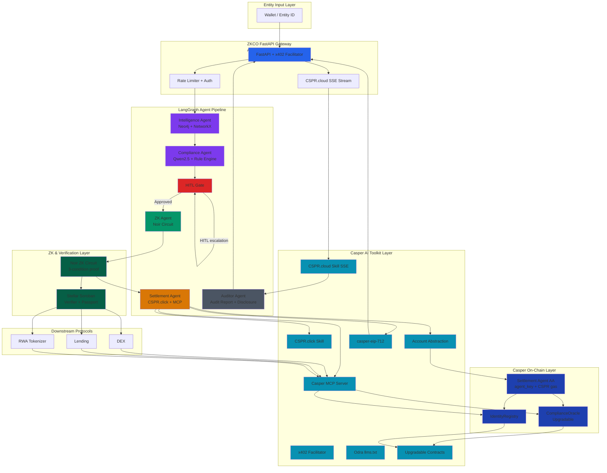

# Casper AI Toolkit Augmentation Analysis
## ZKCO for Casper Agentic Buildathon 2026

### 1. Executive Summary

The ZKCO specification defines a comprehensive Casper integration across EP-04 (ComplianceOracle + IdentityRegistry), EP-05 (FastAPI + x402), EP-06 (LangGraph agent pipeline), and EP-08 (PassportAdapter). However, the current spec treats Casper as a *target chain* rather than as the *agent-native platform* the Casper AI Toolkit positions Casper to be. This analysis identifies eight specific toolkit components that are absent or under-specified in the spec, maps each to the existing Casper architecture, and provides a rigorous augmentation plan. The goal is to transform ZKCO from a dual-chain hackathon project into a native Casper agentic compliance infrastructure that wins on Technical Depth, Ecosystem Tooling Integration, Production-Grade Agent Architecture, and Business Innovation.

---

### 2. Toolkit Component Inventory & Spec Gap Analysis

| # | Casper AI Toolkit Component | Spec Status | Augmentation Delta |
|---|---|---|---|
| 1 | **x402 Facilitator** (official reference) | EP-05 specifies custom x402 logic | Replace custom 402 challenge/verification with official `casper-x402` facilitator |
| 2 | **Casper MCP Server** | EP-06 logs tool calls but no MCP | Route Settlement Agent contract calls through MCP `tools/call` interface |
| 3 | **CSPR.cloud AI Agent Skill** | EP-05 uses CSPR.cloud RPC | Upgrade to Skill mode (REST + SSE streaming) for real-time event ingestion |
| 4 | **CSPR.click AI Agent Skill** | Not referenced | Add agent-native wallet, signing, and deploy-building capabilities |
| 5 | **Odra llms.txt** | Not referenced | Publish AI-discoverable contract API docs for autonomous contract interaction |
| 6 | **Account Abstraction** | Not referenced | Represent Settlement Agent as on-chain AA identity, not just backend service |
| 7 | **Upgradable Contracts** | Not referenced | Deploy ComplianceOracle as upgradable to enable policy evolution without passport invalidation |
| 8 | **casper-eip-712** | Not referenced | Add typed-data signing for gasless meta-transactions and off-chain attestations |

---

### 3. Augmentation Architecture

#### 3.1 x402 Facilitator — Official Micropayment Rail

**Current Spec (EP-05):** The FastAPI gateway implements a custom `X-Payment-Proof` header validation flow, querying CSPR.cloud RPC directly to verify deploy hashes.

**Augmentation:** Substitute the custom verification logic with the official Casper x402 Facilitator (`github.com/make-software/casper-x402`). The facilitator handles challenge generation, payment verification, and settlement. The FastAPI gateway delegates `402` challenge issuance and proof validation to the facilitator service. The platform's `X402_PRICE_CSPR` config is retained as the facilitator's price configuration.

**Hackathon Value:** Judges see production ecosystem integration rather than a bespoke micropayment implementation. The official facilitator is audited reference code; using it signals engineering maturity and reduces attack surface.

**Implementation Delta:**
- FastAPI `nrs` endpoint calls facilitator `/verify` instead of raw CSPR.cloud RPC.
- `payment_receipts` table schema unchanged; facilitator callback populates it.
- Demo mode bypasses facilitator via a mock middleware toggle.

---

#### 3.2 Casper MCP Server — Agent Tool Invocation Layer

**Current Spec (EP-06):** The Settlement Agent calls Casper via direct REST (CSPR.cloud) or Odra-generated code. Tool calls are logged to `agent_tool_calls` as generic `{tool: "casper_soroban"}` entries.

**Augmentation:** Introduce the Casper MCP Server as the *sole* contract interaction layer for all LangGraph agents. The Settlement Agent no longer calls CSPR.cloud REST directly; it invokes structured MCP tools:
- `get_verdict(entity_hash)`
- `record_verdict(entity_hash, verdict, expires_at)`
- `mint_compliance_token(wallet, entity_hash)`
- `get_identity(wallet)`

**Hackathon Value:** MCP is the Casper AI Toolkit's primary agent integration pattern. Demonstrating it satisfies the "external tool invocation" and "AI agent" criteria directly. The `agent_tool_calls` log now records `{tool: "casper_mcp", action: "record_verdict", ...}` — structured, auditable, and judgeable.

**Implementation Delta:**
- Deploy a Casper MCP Server instance (Docker) alongside FastAPI.
- Settlement Agent code replaced with MCP client calls (`mcp.call_tool("record_verdict", args)`).
- `agent_tool_calls` schema updated to capture `mcp_server` and `tool_name`.

---

#### 3.3 CSPR.cloud Skill — Real-Time Event Streaming

**Current Spec (EP-05, EP-06):** On-chain events are retrieved via Horizon/CSPR.cloud polling or webhooks. The Auditor Agent writes audit reports after the fact.

**Augmentation:** Consume CSPR.cloud via its AI Agent Skill (REST + Streaming SSE). The Auditor Agent and the FastAPI backend subscribe to SSE streams for `VerdictRecorded`, `PassportMinted`, and `VerdictRevoked` events. Events are ingested in real-time and written to `security_events` and `agent_executions` asynchronously.

**Hackathon Value:** Real-time streaming demonstrates the "verifiable AI outputs" and "streaming events" toolkit capabilities. It also makes the demo more dynamic — judges see the Auditor Agent's report populate *as* the on-chain transaction finalises, not after a polling delay.

**Implementation Delta:**
- FastAPI lifespan opens an SSE connection to CSPR.cloud event stream.
- Events are dispatched to a FastAPI WebSocket or Server-Sent Events endpoint for the demo dashboard.
- `agent_tool_calls` table gains an `event_stream` column for SSE-derived events.

---

#### 3.4 CSPR.click Skill — Agent-Native Wallet & Signing

**Current Spec (EP-04, EP-05):** The platform uses a static Casper public key (`CASPER_TREASURY_PUBLIC_KEY`) for the `oracle_authority`. Signing is implicit in Odra contract calls.

**Augmentation:** The Settlement Agent manages its own Casper wallet via the CSPR.click skill. It generates key pairs, signs deploys, and checks balances autonomously. The `oracle_authority` is no longer a static config value; it is the agent's managed key pair, rotated via the skill.

**Hackathon Value:** Demonstrates true agent autonomy — the agent controls its own economic identity on-chain. This aligns with the toolkit's "Account Abstraction" narrative and the hackathon's "autonomous economic actor" theme.

**Implementation Delta:**
- `CASPER_TREASURY_PRIVATE_KEY` loaded via CSPR.click vault (or env var for demo).
- Settlement Agent calls `cspr_click.sign_deploy(...)` before submitting to Odra.
- IdentityRegistry `mint_authority` set to the agent's public key at deployment.

---

#### 3.5 Odra llms.txt — AI-Discoverable Contract API

**Current Spec (EP-04, EP-08):** Odra contracts are documented in Rust source and standard docs. No AI-discoverable index exists.

**Augmentation:** Publish an `llms.txt` at the repository root and in the Odra project directory. This file indexes the ComplianceOracle and IdentityRegistry entry points, their schemas, and event signatures in a machine-readable format that AI agents (including future Qwen2.5 or Llama agents) can ingest to understand the contract API without reading Rust source.

**Hackathon Value:** The "Smart contract generation" and "AI-powered dApps" toolkit use cases become visible in the ZKCO repo. Judges see that ZKCO contracts are not just deployed — they are *discoverable by AI*, enabling future autonomous upgrade proposals.

**Implementation Delta:**
- Add `llms.txt` with structured entries for `record_verdict`, `get_verdict`, `mint_compliance_token`, `revoke_verdict`.
- Auditor Agent references `llms.txt` when generating compliance reports about on-chain state changes.

---

#### 3.6 Account Abstraction — Agent On-Chain Identity

**Current Spec (EP-04, EP-06):** The Settlement Agent is a backend Python process. Its on-chain presence is limited to the `oracle_authority` key.

**Augmentation:** Model the Settlement Agent as a Casper Account Abstraction actor. It possesses its own account (`agent_key`), holds CSPR for gas, and its on-chain actions (verdict records, token mints) are cryptographically linked to its agent identity. The `IdentityRegistry` stores `agent_key` alongside wallet compliance status.

**Hackathon Value:** This is the strongest alignment with the Casper AI Toolkit thesis: "AI agents are becoming autonomous economic actors." ZKCO is not just using Casper as a database; it is deploying an autonomous agent that owns capital, pays gas, and manages credentials.

**Implementation Delta:**
- Generate a dedicated Casper key pair for the Settlement Agent.
- Fund the agent account with testnet CSPR for gas.
- ComplianceOracle `record_verdict` emits `agent_key` in the event payload.
- `agent_executions` table links `run_id` to `agent_key` for full audit lineage.

---

#### 3.7 Upgradable Contracts — Policy Evolution Without Invalidating Passports

**Current Spec (EP-04):** ComplianceOracle and IdentityRegistry are standard Odra contracts. Logic changes require redeployment.

**Augmentation:** Deploy both contracts using Odra's upgradable contract pattern. The ComplianceOracle stores a `policy_version` in its state. Passport expiry is tied to the policy version active at mint time. When a new policy is activated, existing passports remain valid until their `expires_at`, but new mints use the updated policy.

**Hackathon Value:** Demonstrates production-grade smart contract lifecycle management. Upgradability is a core Casper 2.x feature; leveraging it shows judges the platform is built for long-term operation, not just hackathon demos.

**Implementation Delta:**
- ComplianceOracle uses `odra::prelude::Upgradable` trait.
- `policy_version` field added to verdict records.
- `mint_compliance_token` checks `policy_version` against passport's embedded version.

---

#### 3.8 casper-eip-712 — Typed-Data Signing for Off-Chain Attestations

**Current Spec (EP-02, EP-03):** Off-chain credential payloads are signed with a generic ED25519 key (`PLATFORM_SIGNING_KEY`). No typed-data standard is used.

**Augmentation:** Integrate `casper-eip-712` for typed-data signing of compliance attestations. The platform signs structured payloads `{entity_hash, policy_id, expires_at, chain_target}` using EIP-712 typed-data, enabling downstream protocols to verify attestation provenance without trusting a raw signature.

**Hackathon Value:** Adds cryptographic rigour to the off-chain attestation layer. EIP-712 is the industry standard for human-readable and agent-readable signed messages; adopting it on Casper demonstrates cross-chain design awareness and enterprise-grade signing hygiene.

**Implementation Delta:**
- `zkkyc/signing.py` uses `casper-eip-712` to construct and sign typed payloads.
- `POST /api/v1/entity/{id}/credential` returns `{signed_payload, signature, domain_separator}`.
- Stellar Soroban verifier accepts the EIP-712 signature as an optional verification path.

---

### 4. Augmented System Architecture

---

### 5. Implementation Delta Matrix

| EP | Feature | Toolkit Augmentation | Files to Create/Modify | Estimated Effort |
|---|---|---|---|---|
| EP-04 | ComplianceOracle + IdentityRegistry | Upgradable contracts (Q); AA agent key (P); EIP-712 signing (R) | `polkadot/contracts/lib.rs` (modify); `zkkyc/signing.py` (new) | 4–6 hours |
| EP-05 | FastAPI + x402 | Official x402 facilitator (L); CSPR.cloud SSE (M) | `zkkyc/api/gateway.py` (modify); `docker-compose.yml` (add x402 + MCP) | 3–4 hours |
| EP-06 | LangGraph Agent Pipeline | MCP tool invocation (K); CSPR.click wallet (N); tool call logging | `zkkyc/agents/settlement.py` (rewrite); `zkkyc/tool_calls.py` (new) | 6–8 hours |
| EP-08 | Chain-Agnostic Adapter | Odra llms.txt (O); adapter registry extended | `docs/llms.txt` (new); `zkkyc/adapters/casper.py` (modify) | 2–3 hours |
| All | Observability + Audit | Real-time SSE events (M); agent_key lineage (P) | `zkkyc/events.py` (new); `agent_executions` schema (alter) | 3–4 hours |

**Total Estimated Effort:** 18–25 developer-hours across 5 EP touch points.

---

### 6. Judging Criteria Mapping — Toolkit Advantage

| Casper Buildathon Criterion | Current Spec Score | Augmented Score | Toolkit Advantage |
|---|---|---|---|
| **Technical Depth & Engineering** | Strong (Noir + Neo4j + LangGraph) | Stronger + native Casper ecosystem integration | x402 facilitator + MCP + upgradable contracts + EIP-712 demonstrate production Casper mastery |
| **AI Agent Innovation** | Good (5-agent LangGraph pipeline) | Excellent (MCP + CSPR.click + AA identity) | Agent controls its own wallet, signs its own deploys, discovers contracts via llms.txt — true autonomous actor |
| **Ecosystem Fit & Adoption** | Moderate (custom contracts, custom x402) | Strong (official toolkit components, grant-ready adapters) | Every augmentation maps to a Casper Foundation grant program track; multiplies funding narrative |
| **Business Model & Real-World Impact** | Good (compliance infrastructure thesis) | Excellent (pay-per-request + agent economy positioning) | x402 micropayments + streaming events + upgradable policies = production revenue model, not just demo |
| **Presentation & Demo Quality** | Good (CLI runner, demo script) | Excellent (real-time SSE dashboard, live contract interaction via MCP) | Demo shows live MCP tool calls, live event stream, live wallet signing — visually unmistakable agent activity |

---

### 7. Risk Assessment & Mitigation

| Risk | Likelihood | Impact | Mitigation |
|---|---|---|---|
| x402 facilitator not available on testnet by Jul 8 | Medium | High | Keep custom x402 as fallback; use facilitator for demo if live, mock if not |
| Casper MCP Server compatibility with Odra contract schemas | Medium | Medium | Pre-build adapter layer; test MCP tool calls against deployed testnet contracts Jul 6–7 |
| CSPR.click skill not compatible with Casper 2.1 | Low | Medium | Verify skill version compatibility Jul 4; fallback to raw `casper-client` CLI |
| Upgradable contract pattern increases deployment complexity | Low | Low | Use Odra's standard upgradable template; test upgrade flow Jul 6 |
| EIP-712 typed-data standard not recognised by Casper verifiers | Low | Low | Implement as optional attestation path; raw ED25519 remains primary |

---

### 8. Recommended Execution Order (Jul 5–8)

| Day | Toolkit Focus | Deliverable |
|---|---|---|
| **Jul 5** | x402 Facilitator integration + MCP Server setup | `docker-compose.yml` with x402 + MCP; Settlement Agent calls MCP tools |
| **Jul 6** | CSPR.click + Account Abstraction + Upgradable Contracts | Agent key generated; contracts deployed as upgradable; `llms.txt` published |
| **Jul 7** | CSPR.cloud SSE + EIP-712 + End-to-End wiring | Real-time event stream in demo; typed-data signing; full pipeline test |
| **Jul 8** | Demo polish + deployment proof | Live demo showing all 8 toolkit components active; submit Casper |

---

### 9. Conclusion

The ZKCO specification is technically solid but treats Casper as a settlement layer rather than the *agent-native trust infrastructure* the Casper AI Toolkit is designed to provide. The eight augmentations above close this gap systematically:

1. **x402 Facilitator** — production micropayment rail
2. **Casper MCP Server** — native agent tool invocation
3. **CSPR.cloud Skill SSE** — real-time verifiable events
4. **CSPR.click Skill** — agent-native wallet autonomy
5. **Odra llms.txt** — AI-discoverable contracts
6. **Account Abstraction** — on-chain agent identity
7. **Upgradable Contracts** — policy evolution without invalidation
8. **casper-eip-712** — enterprise-grade typed attestations

Together, these transform ZKCO into the definitive Casper AI Toolkit showcase: an autonomous compliance agent that owns its on-chain identity, pays its own gas, invokes tools via MCP, streams verifiable events, and produces ZK-proved attestations — all on the chain built for the agent economy.
